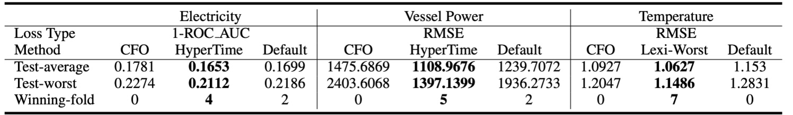
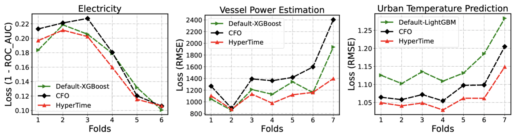
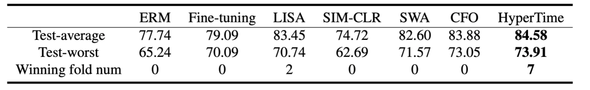
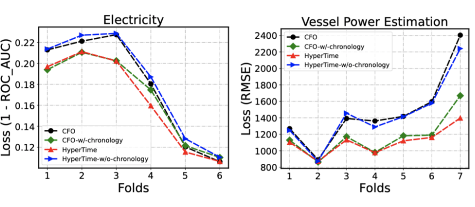
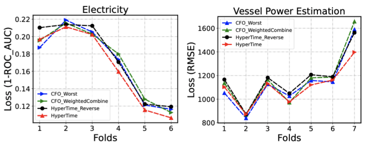
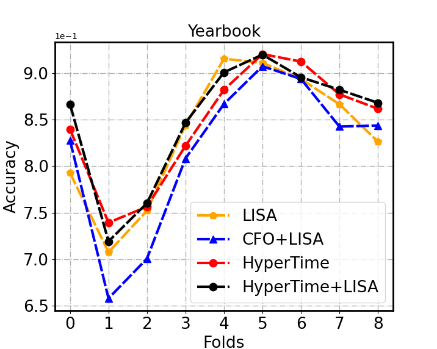
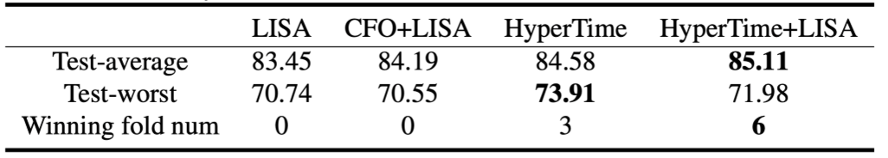

# HyperTime: Hyperparameter Optimization for Combating Temporal Distribution Shifts

## Introduction

This repository is the implementation of NeurIPS 2023 submission **HyperTime: Hyperparameter Optimization for Combating Temporal Distribution Shifts**. 

The implementation of our method HyperTime is built upon an open-source AutoML library named FLAML. Thus the submitted code includes part of flaml’s code. But we emphasize that the contributors and copyright information about the open-source library FLAML do not necessarily reveal the identities of the authors of this work. 

This version of the code is made to facilitate the peer review of the NeurIPS 2023 submission of our paper. 
We plan to release the code accompanying the formal publication of this paper. 

## Datasets

### Datasets in the main experiments

- Electricity: A classification task which is available on [OpenML](https://www.openml.org/search?type=data&sort=runs&id=151&status=active). It is widely used for
evaluating distribution shifts mitigation methods. The dataset contains two and a half years
of data. We exclude the first half years and use the next
year for training and the last year for testing. We split
every 2 months into one fold. 

- Vessel power estimation: A regression task taken from
Wild-Time benchmark (Malinin et al., 2021). It is a large
dataset with 523,190 training samples over 4 years, and
we use the out-of-distribution dev-set as our test data
which has 18,108 samples. We split the training data
uniformly into 12 folds, and the test data into 7 folds.

- Temperature prediction: A regression task to predict
the urban daily maximum of average 2-m temperature. It
has distribution shifts as mentioned in (Kay et al., 2015;
Oleson et al., 2018). We split every 5 years into one fold
and we use the first 40 years for training and testing on
the remaining 35 years. More information could be found in [3].

- Yearbook: Yearbook is an image classification
dataset which consists of 33,431 American high school year-
book photos. Since the changing of the social norms, fashion
styles, and other potential factors that may change with the
passage of time, there exist temporal distribution shifts in
it. We use the same experiment setting as [1].


### Datasets in the supplementary experiments 

In addition to the Yearbook dataset in Wild-Time benchmark. We also perform experiments on all other 4 datasets (5 tasks) of Wild-Time benchmark in the supplementary section to demonstrate HyperTIme is consistently better than ERM. It includes (1) ICU patient readmission prediction (**MIMIC-Readmission**), (2) ICU patient mortality prediction (**MIMIC-Mortality**), (3) news tag classification (**Huffpost**), (4) article category classification (**arXiv**) and (5) satellite image classification (**FMoW-Time**). We use the same Eval-fix setting as Wild-Time to perform the experiments. More information for these datasets and the settings of the experiment could be found in [1].

<!-- In tuning XGboost, we verify the performance of LexiFlow on the datasets shown below. All of these datasets are available on OpenML.

1. In tuning random forest and Xgboost, the datasets we use in our paper are all available in openml.
2. In tuning neural networks, we verify the performance of LexiFLOW on [FashionMnist](https://www.kaggle.com/datasets/zalando-research/fashionmnist) dataset. -->

## Experiments

### **Requirements**

To install requirements:
```setup
pip install -r requirements.txt
```


### **How to run** 

1. **Main experiments**
- Tabular Data

	```python
	# Run single train
	python exp_tabular/main.py  --algorithm 'hypertime' \
                	--dataset 'electricity' \
                	--estimator 'xgboost' \
                	--metric 'roc_auc' \
                	--budget 7200 \
                	--seed 1 &

	# Run single test
	python exp_tabular/test.py --algorithm 'hypertime' \
                	--dataset 'electricity' \
                	--estimator 'xgboost' \
	               	--metric 'roc_auc' \
                	--budget 7200 \
                	--seed 1 &

	#Run batch train
	bash scripts/run_electricity.sh

	#Run batch test
	bash scripts/run_test.sh
	```

    It will run HyperTime on electricity with XGboost. The time budget is 7200.


- YearBook 

    ```python
    # Search HPs
    python exp_yearbook/main.py --dataset yearbook \
                                --estimator nn \
                                --metric accuracy \ 
                                --budget 10800 \ 
                                --algorithm hypertime \
                                --seed 0 &

    # Test
    python exp_yearbook/test.py --dataset yearbook \
                                --estimator nn \
                                --metric accuracy \ 
                                --budget 10800 \
                                --algorithm hypertime \
    ```

    It will run hypertime on yearbook with Neural networks. The time budget is 10800s.


2. **Other Experiments**

- Combining HPO algorithms with robust training method LISA**

    ```python
    python Tune-Lisa/yearbook.py --budget 10800  \
                                 --hpo_method hyperTime \ 
                                 --seed 0 \  
                                 --device 0 \
    ```    

- Experiments on other datasets in Wild-Time 
   
    ```python
    # Search
    python exp_wildtime/main.py  --budget 14400  \
                                 --algorithm hypertime \ 
                                 --seed 0 \  
                                 --cudaid 0 \
                                 --dataset mimic-mortality 21600 \
                                 --metric accuracy \ 
                                 --estimator nn \

    # Test
    python exp_wildtime/test.py  --budget 14400  \
                                 --algorithm hypertime \ 
                                 --cudaid 0 \
                                 --dataset mimic-mortality 21600 \
                                 --metric accuracy \ 
                                 --estimator nn \

    ```    


## Results - Effectiveness

1. **Results on tuning tree-based learners**

    <p float="left">
    
    </p>


    <p float="left">
    
    </p>
    
    <!-- <p float="left">
    
    </p> -->


2. **Results on tuning neural networks**

    <p float="left">
    
    </p>


    <!-- <p float="left">
    
    </p> -->

## Results - Ablation

1. **The construction of validation sets**
   
    <p float="left">
    
    </p>

2. **The orientation of optimization objectives**

    <p float="left">
    
    </p>


## Results - Combining with robust training method
1. Results on different folds
<center>

</center>

2. Overall results
<p float="middle">

</p>

## More Results on Wilds-Time benchmark

|                        | MIMIC-Readmission | MIMIC-Mortality | Huffpost  |     Arxiv | FMoW-Time |
|------------------------|-------------------|-----------------|-----------|----------:|-----------|
| Test-average-ERM       |       48.02       |      77.24      |   70.60   |   46.39   |   58.05   |
| Test-worst-ERM         |       43.68       |      73.45      |   69.14   |   44.53   |   46.40   |
| Test-average-HyperTime |     **54.81**     |    **78.26**    | **71.68** | **48.48** | **59.17** |
| Test-worst-HyperTime   |     **51.44**     |    **74.52**    | **69.72** | **46.52** | **50.02** |

We report the results of ERM by running the official code of Wilds-Time. One of the main conclusions of Wild-Time benchmark is that there is no existing method that could consistently outperform  ERM in all datasets of Wild-Tim. However, our observations indicate that HyperTime is consistently better than ERM on Wild-Time. This demonstrates that HyperTime is a promising method compared to existing baselines.

## References
[1]: Yao, H., Choi, C., Lee, Y., Koh, P. W., and Finn, C.
Wild-time: A benchmark of in-the-wild distribution shift
over time. In ICML 2022 Shift Happens Workshop,
2022a

[2]: Malinin, A., Band, N., Gal, Y., Gales, M., Ganshin, A., Ches-
nokov, G., Noskov, A., Ploskonosov, A., Prokhorenkova,
L., Provilkov, I., Raina, V., Raina, V., Roginskiy, D.,
Shmatova, M., Tigas, P., and Yangel, B. Shifts: A
dataset of real distributional shift across multiple large-
scale tasks. In Thirty-fifth Conference on Neural Infor-
mation Processing Systems Datasets and Benchmarks
Track (Round 2), 2021

[3]: Zheng, Z., Zhao, L., and Oleson, K. W. Large model
structural uncertainty in global projections of urban heat
waves. Nat Commun, 12(1), 2021. ISSN 2041-1723. 
